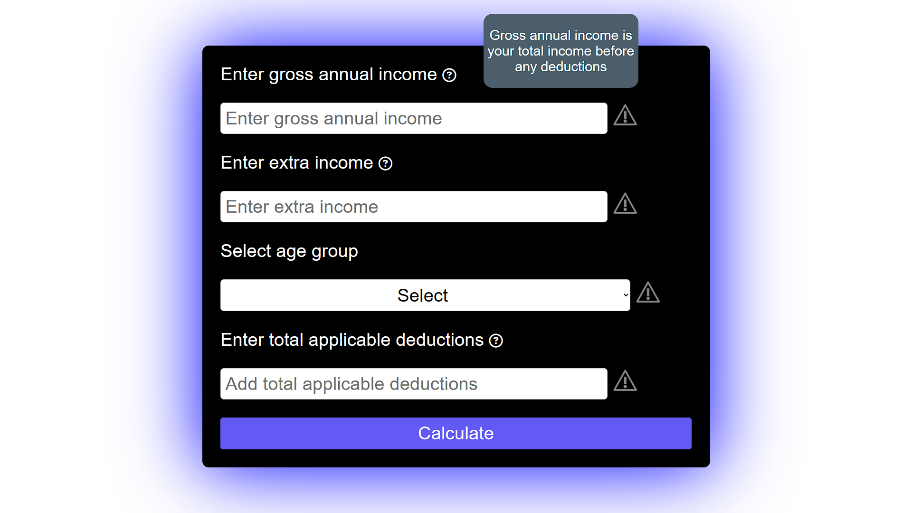
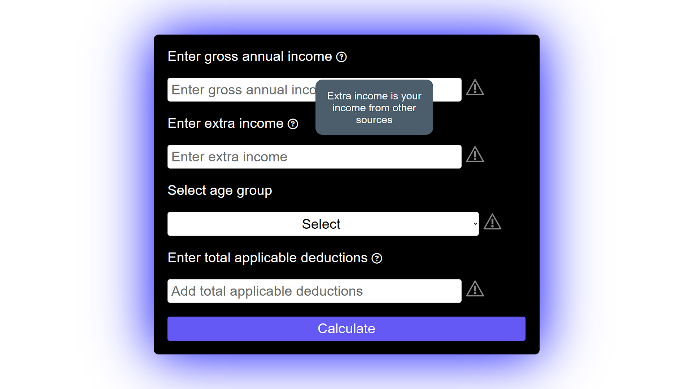
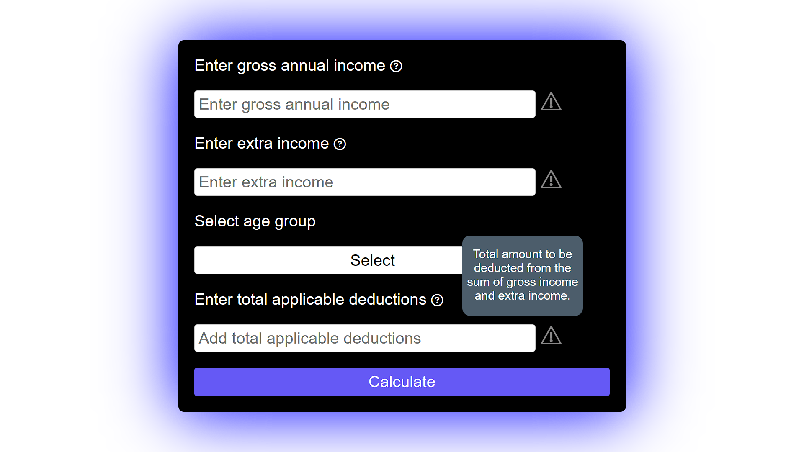
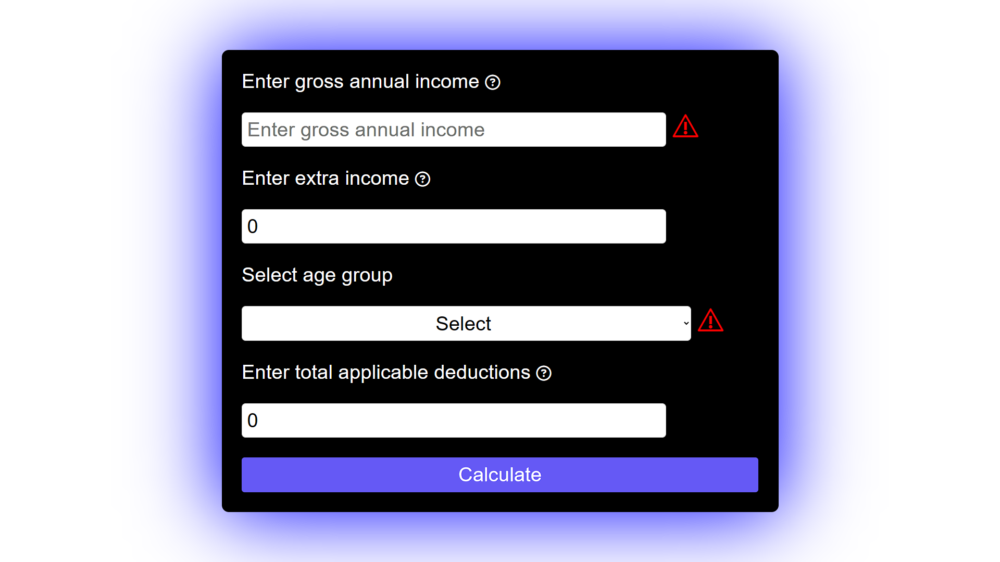
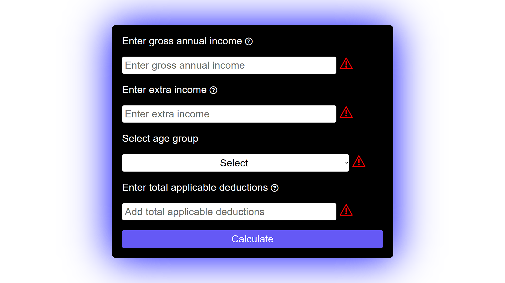
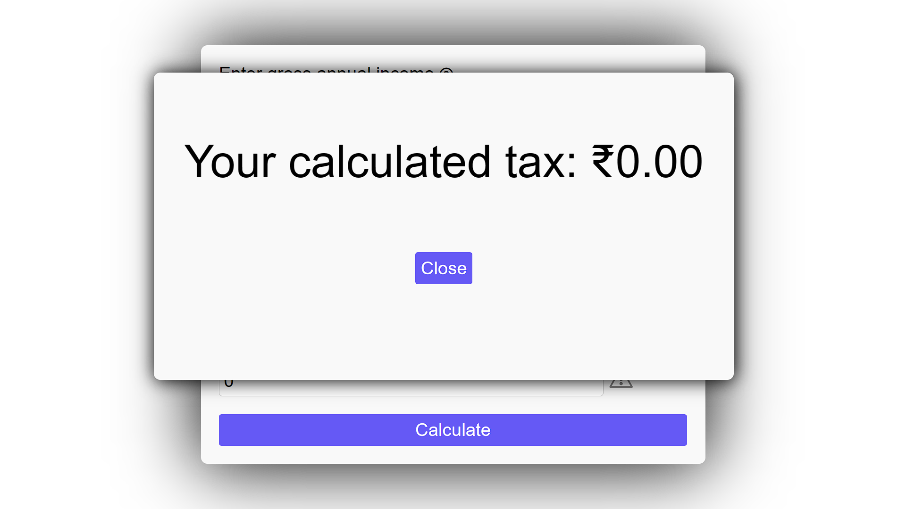
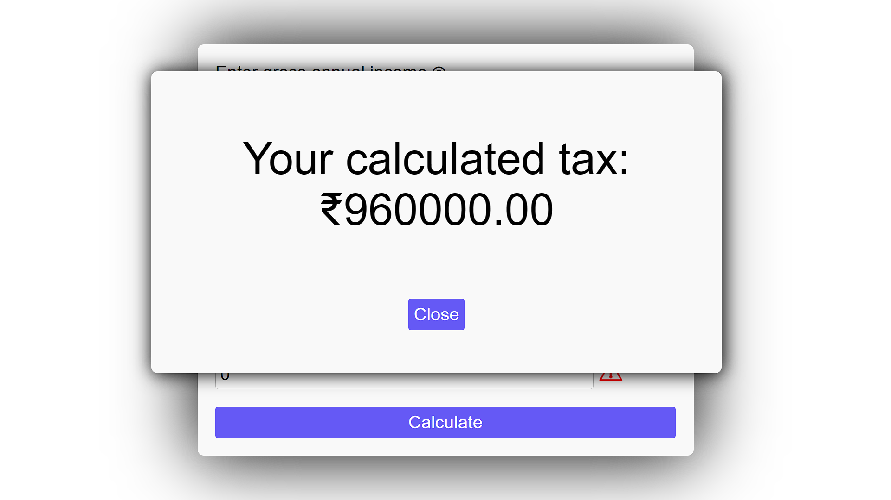
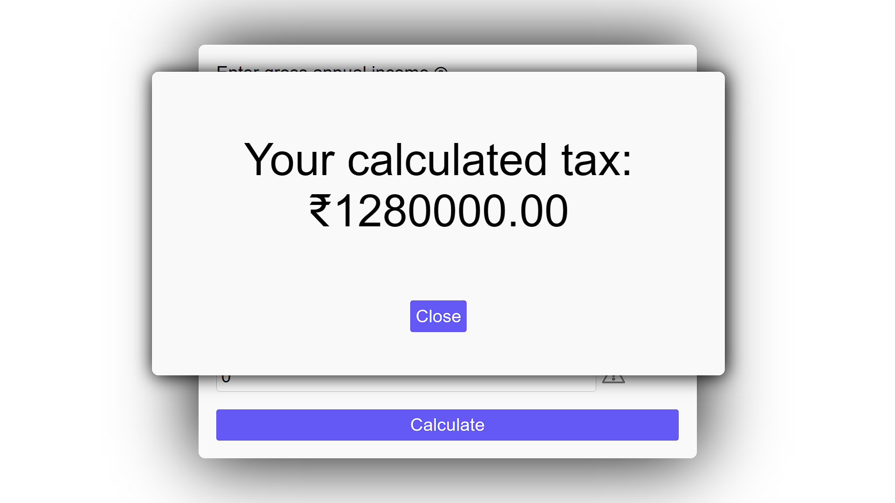

# Tax-Calculator

Hello everyone,

Abhinav Sharma this side, I have made a TAX CALCULATOR as a selection criteria for the internship. Here you can find some glimples of the website.

link to use the website :- https://abhinav163.github.io/Tax-Calculator/

Main page(desktop view):- .png)
Main page (Phone View):- .jpg)

HOVERING EFFECT GLIMPES :- 

1 :- 
2 :- 
3 :- 

INCOMPLETE DETAILS ERROR :-

1 :- 
2 :- 

Test Case :- 
1)   Gross income :- 0
     Ext income :- 0
     Age :- <40
     Deduction :- 0
     

2)   Gross income :- 40,00,000
     Ext income :- 0
     Age :- <40
     Deduction :- 0
     

3)   Gross income :- 40,00,000
     Ext income :- 0
     Age :- >40 and <60
     Deduction :- 0
     
